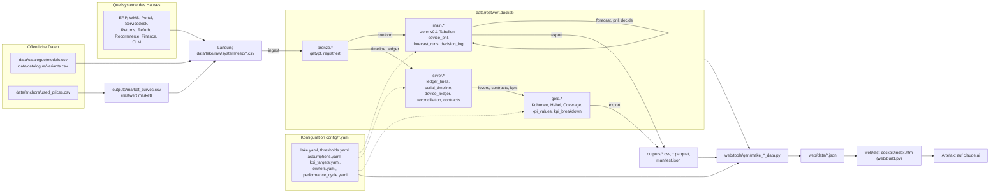
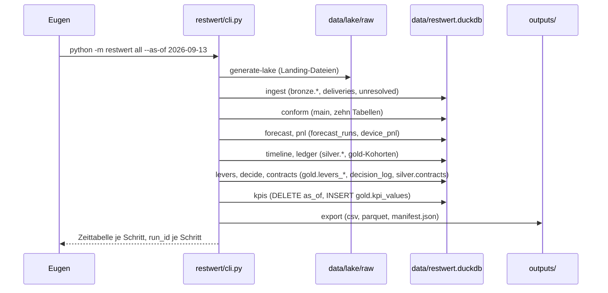

# Architektur der Restwert Engine: wie welche Daten wohin kommen

Stand 18.09.2026, Paketversion 0.4.0. Geschrieben für den Einkaufsleiter, der das Werkzeug betreibt, und für einen COO oder CFO, der es verstehen will, ohne Code zu lesen. Das Haus heißt hier „der DaaS-Anbieter". Jede genannte Datei, Tabelle, Spalte und jeder Befehl existiert im Repo unter genau diesem Namen. Alle Zahlen im Repo sind synthetisch, bis auf den öffentlichen Katalog und die öffentlichen Preisbelege, die ihre Quell-URL tragen.

> THE MODEL ADVISES, DETERMINISTIC CODE DECIDES, A NAMED HUMAN OWNS EVERY THRESHOLD.

## 0. In einem Satz

Exporte der Quellsysteme landen als Dateien, werden in eine Datenbankdatei mit drei Schichten (Bronze, Silber, Gold) verarbeitet, aus Gold entstehen Kennzahlen, Hebel und Entscheidungen, daraus baut ein Generator die Daten der Seite, und die Seite wird als Artefakt veröffentlicht; nichts davon läuft von allein, jeder Schritt ist ein Befehl.



Textfassung: Links stehen die Quellsysteme des Hauses und daneben die öffentlichen Daten (Katalog, Preisbelege). Beides landet als CSV-Datei in `data/lake/raw/<system>/<feed>/`. Der Befehl `ingest` liest die Landung nach `bronze`, `conform` baut daraus die zehn v0.1-Tabellen in `main`, `timeline` und `ledger` bauen `silver`, `levers`, `contracts` und `kpis` bauen `gold`. Die Konfiguration unter `config/` speist alle Rechenschritte mit Schwellen, Annahmen, Zielen und Rollen. `export` schreibt jede Tabelle als CSV und Parquet nach `outputs/`. Die Generatoren unter `web/tools/gen/` lesen `outputs/`, die Datenbankdatei und `config/` und schreiben je Reiter eine JSON-Datei nach `web/data/`. `web/build.py` bettet diese Dateien in eine HTML-Datei ein, und diese Datei wird mit ihren Skripten als Artefakt veröffentlicht.

## 1. Die Quellen: wo welche Daten herkommen

Neunzehn Feeds sind als Quellverträge in `restwert/lake/feeds.py` definiert und in `docs/DATA_LAKE.md` vollständig gerendert (jede Spalte, Typ, Pflicht, geschlossene Liste). Heute liefert alle Fleet-Feeds der synthetische Generator `python -m restwert generate-lake`, gesteuert von `config/lake.yaml`; die drei Referenzfeeds sind Kopien öffentlicher Dateien. Der Takt der synthetischen Lieferungen ist `delivery_cadence: quarterly`: 19 Lieferperioden bis zum Stichtag 2026-09-13. Der Takt eines echten Hauses ist der Exporttakt seiner Systeme; der Import verlangt keinen bestimmten. Pflichtspalte überall: `is_synthetic`; ein echter Export trägt `false`.

| Quelle | Feed (Ordner unter `data/lake/raw/`) | Pflichtspalten | Liefersystem (heute) | Takt heute | Schicht und Kennzahlen |
|---|---|---|---|---|---|
| Katalog | `catalogue/models` | slug, model_name, oem, family, is_synthetic | Kopie von `data/catalogue/models.csv` (öffentlich) | einmal zum Stichtag | `bronze.cat_models`; Modell, Hersteller, Launchdatum im Hauptbuch |
| Katalog | `catalogue/variants` | slug, spec, is_synthetic | Kopie von `data/catalogue/variants.csv` (öffentlich) | einmal | `bronze.cat_variants`; `rrp_net_eur`; `KPI_PUR_DISCOUNT_VS_RRP`, `KPI_PUR_LANDED_VS_RRP` |
| Preisbelege | `market/curves` | group_kind, group, population, fit_quality, is_synthetic | Kopie von `outputs/market_curves.csv`, gefittet durch `python -m restwert market` auf `data/anchors/used_prices.csv` | einmal | `bronze.mkt_curves`; `anchor_rv_lease_end`; `KPI_RES_ESTIMATE_VS_ANCHOR` |
| Vertragsregister | `contracts/register` | contract_id, counterparty_name, counterparty_role, counterparty_is_public, category, start_date, end_date, notice_days, auto_renewal, price_protection, payment_terms_days, spend_under_contract_eur, terms_note, is_synthetic | CLM (Generator, synthetisch) | je Quartal | `bronze.ctr_register`, `silver.contracts`, `gold.contract_coverage_by_oem`; `KPI_CTR_COVERAGE_BY_OEM` |
| ERP Einkauf | `erp/purchase_orders` | po_number, supplier_id, supplier_name, supplier_role, order_date, promised_date, currency, is_synthetic | ERP (Generator, synthetisch) | je Quartal | Lieferant und Rolle je Gerät; Zeitstempel `ordered_at` |
| ERP Einkauf | `erp/po_lines` | po_number, po_line, slug, storage_gb, qty_ordered, unit_price_eur, order_date, is_synthetic | ERP (Generator, synthetisch) | je Quartal | Zeile `purchase_price`, bis die Stückrechnung kommt; Regel R07 |
| ERP Wareneingang | `erp/goods_receipts` | gr_number, po_number, po_line, serial, received_at, is_synthetic | ERP oder WMS (Generator, synthetisch) | je Quartal | **prägt die Seriennummer**; jeder spätere Feed löst dagegen auf; `KPI_DATA_CHAIN_COMPLETE` |
| ERP Kreditoren | `erp/supplier_invoices` | invoice_number, invoice_line, supplier_id, po_number, po_line, invoice_date, line_kind, qty, amount_eur, currency, is_synthetic | ERP (Generator, synthetisch) | je Quartal | Zeilen `purchase_price`, `freight`, `duty`, `price_protection_credit`; `KPI_PUR_PRICE_PROTECTION_CAPTURE`; Beiträge C2 |
| ERP Preislisten | `erp/price_changes` | change_id, supplier_id, slug, storage_gb, valid_from, old_unit_price_eur, new_unit_price_eur, is_synthetic | ERP (Generator, synthetisch) | je Quartal | Preisschutzfenster; Regel R05, Hebel L02 |
| Staging | `wms/staging_log` | staging_id, serial, staged_at, mdm_enrolled, staging_cost_eur, is_synthetic | Staging-System (Generator, synthetisch) | je Quartal | Zeile `staging`; `mdm_enrolled` schaltet `mdm_operations`; Zeitstempel `staged_at` |
| Versand | `wms/shipments` | shipment_id, serial, direction, shipped_at, carrier_ref, cost_eur, is_synthetic | Versandsystem (Generator, synthetisch) | je Quartal | Zeilen `outbound_shipping`, `replacement_logistics`, `return_logistics` je nach `direction` |
| Kundenportal | `portal/rental_contracts` | contract_id, customer_id, serial, start_date, term_months, monthly_rate_eur, end_date, status, is_synthetic | Portal (Generator, synthetisch) | je Quartal | `term_months`, `monthly_rate`, `contract_end_planned`; Regel R06 |
| Portal Abrechnung | `portal/rental_invoices` | invoice_id, contract_id, serial, period_no, period_month, invoice_date, amount_eur, is_synthetic | Portal (Generator, synthetisch) | je Quartal | Zeile `rental_revenue` plus je Monat die Umlagen `support` und `mdm_operations`; `KPI_RSLT_CLOSED_PER_DEVICE` |
| Servicedesk | `servicedesk/tickets` | ticket_id, serial, opened_at, damage_type, resolution, quote_eur, repair_partner_ref, is_synthetic | Ticketsystem (Generator, synthetisch) | je Quartal | Zeile `repair`; Regel R01, Hebel L04; Beiträge C4 |
| Rücknahme | `returns/receipts` | receipt_id, serial, returned_at, grade_declared, grade_inspected, inspected_at, wipe_grading_cost_eur, is_synthetic | Rücknahmeplatz (Generator, synthetisch) | je Quartal | Zeile `wipe_grading`; Zeitstempel `returned_at`, `graded_at`; `KPI_RSL_DAYS_RETURN_TO_CASH` |
| Aufbereitung | `refurb/work_orders` | work_order_id, serial, started_at, finished_at, cost_eur, grade_out, outcome, partner_ref, is_synthetic | Aufbereitungspartner (Generator, synthetisch) | je Quartal | Zeile `refurbishment`; `grade_out`; Zeitstempel `sellable_at` |
| Wiederverkauf | `recommerce/orders` | order_id, serial, channel, listed_at, sold_at, gross_price_eur, buyer_type, grade_at_sale, is_synthetic | Verkaufssystem je Kanal (Generator, synthetisch) | je Quartal | Zeile `resale_gross`; `KPI_RSL_REALISED_VS_RECORD`; Regel R02, Hebel L03 |
| Kanalabrechnung | `recommerce/credit_notes` | credit_note_id, order_id, serial, channel, credited_at, gross_eur, fee_pct_eur, fee_fixed_eur, net_eur, is_synthetic | Kanalabrechnung (Generator, synthetisch) | je Quartal | Zeile `channel_fee`; Zeitstempel `credited_at`; senkt `KPI_TCO_ESTIMATE_SHARE` |
| Finanzen | `finance/indirect_spend` | spend_id, invoice_date, category, supplier_name, amount_eur, has_po, has_contract, saving_eur, saving_confirmed_by_controlling, is_synthetic | Kreditorenbuch indirekt (Generator, synthetisch) | je Quartal | `main.indirect_spend`; v0.1-Kennzahlen der Fläche Indirekt; Beiträge B1 |

## 2. Die Landung und der Import

**Dateiname.** `data/lake/raw/<system>/<feed>/<YYYY-MM-DD>_<feed>_<seq>.csv`; das Datum ist das Lieferdatum, `<seq>` ist dreistellig. Beispiel aus dem Repo: `catalogue/models/2026-09-13_models_001.csv`. Eine gelandete Datei wird nie verändert; eine Korrektur ist eine neue Lieferung.

**Kennzeichnungszeile.** Zeile 1 einer generierten Datei lautet `# SYNTHETIC DATA - restwert generate-lake seed=42 feed=<feed> delivery=<datum>`, die einer Katalogkopie `# PUBLIC DATA - ...`. Ein echter Export hat keine `#`-Zeile. An dieser Zeile erkennt `all`, welche Dateien es vor einem Neulauf löschen darf: nur generierte. Eine echte Datei blockiert den Lauf und wird beim Namen genannt; nur `--wipe-raw` hebt das auf.

**Jede Datei zählt nur einmal, auch wenn sie zweimal hochgeladen wird.** Der Import erkennt eine Datei an ihrem Inhalt, nicht an ihrem Namen: `ingest` bildet den SHA-256 jeder Datei (einen Fingerabdruck des Inhalts) und schreibt ihn nach `bronze.deliveries.sha256` (UNIQUE). Dieselbe Datei ein zweites Mal ist ein No-Op und wird mit den gespeicherten Zählern gemeldet; `ingest --all` darf beliebig oft laufen. `data/lake/raw/_manifest.json` listet die Dateien mit Hash, ist aber reine Dokumentation; der Import hasht selbst.

**Der Ablauf je Datei**, eine DuckDB-Transaktion (`restwert/lake/ingest.py`):

1. Hash prüfen gegen `bronze.deliveries`.
2. Alle Spalten als Text lesen, `#`-Zeilen überspringen, `is_synthetic` prüfen.
3. Typisieren. Ablehnungsgründe: `missing_required`, `bad_type`, `bad_enum`, `negative_amount`. Eine abgelehnte Zeile bricht die Datei nie ab.
4. Schlüssel auflösen gegen die Elterntabelle in Bronze: `unknown_serial`, `unknown_po`, `unknown_po_line`, `unknown_contract`, `unknown_order`, `unknown_slug`, `unknown_variant`.
5. Deduplizieren über `row_hash`: gleicher Geschäftsschlüssel mit gleichem Inhalt ist ein Duplikat (gezählt, übersprungen); **gleicher Schlüssel mit anderem Inhalt ist ein Konflikt** (`duplicate_conflict`), die erste Lieferung bleibt stehen.
6. Neue Zeilen anhängen mit der Schwanzspalte `delivery_id, source_file, row_number, ingested_at, row_hash, is_synthetic`; ungeklärte Zeilen nach `bronze.unresolved` (`reason_code`, `reason_text`, `row_json`); eine Zeile nach `bronze.deliveries` (`rows_read`, `rows_typed`, `rows_new`, `duplicates_identical`, `duplicates_conflict`, `n_unresolved`).

Die zwölf Grundcodes sind eine geschlossene Liste in `restwert/lake/feeds.py`. Nichts stromabwärts rät je einen fehlenden Schlüssel.

**Befehle.**

```
python -m restwert ingest --all [--lake-dir data/lake] [--dry-run] [--db data/restwert.duckdb]
python -m restwert ingest --source erp/goods_receipts --file <pfad> --dry-run
```

`--dry-run` rollt die Transaktion zurück und hinterlässt nichts; er meldet je Datei eine Zeile wie `erp/goods_receipts 2023-12-31_goods_receipts_002.csv read=1210 new=1198 dup=8 conflict=1 unresolved=3 (unknown_po_line=3)`.

## 3. Die Schichten und ihre Tabellen

Alles liegt in einer Datei, `data/restwert.duckdb`, mit den Schemas `bronze`, `silver`, `gold` neben `main`. `export --lake` spiegelt Bronze, Silber und Gold als Parquet nach `data/lake/bronze/`, `data/lake/silver/`, `data/lake/gold/`; die Spiegel sind Kopien für Leser ohne DuckDB, nie die Wahrheit.

### Bronze: getypte Kopie der Landung

Bronze ist die Landung, nur getypt und registriert: eine Tabelle je Feed (19 Feedtabellen, `bronze.cat_models` bis `bronze.fin_indirect_spend`) mit den Spalten des Feeds, dazu zwei Registertabellen. `bronze.deliveries` hält eine Zeile je gelandeter Datei mit ihrem Fingerabdruck und den Zählern des Imports; `bronze.unresolved` hält jede Zeile, die nicht getypt oder nicht zugeordnet werden konnte, mit ihrem Grund. Beide speisen den Reiter Daten und `KPI_DATA_UNRESOLVED_SHARE`. Von Bronze lesen `conform`, `timeline` und `ledger`. Tabellen und Spalten: Anhang A.

### Main: die v0.1-Engine, unverändert

`conform` baut aus Bronze die zehn v0.1-Quelltabellen (`model_catalogue`, `devices`, `purchase_orders`, `benchmarks`, `rental_contracts`, `events`, `refurbishment`, `resale`, `supplier_contracts`, `indirect_spend`) und schreibt sie bei jedem Lauf komplett neu; zusätzlich als Kompatibilitäts-CSV nach `data/raw_csv/`. Darauf laufen unverändert `forecast` (`forecast_runs`, `rv_forecast_grid`, `rv_forecast_current`, `rv_forecast_of_record`, `rv_forecast_error_monthly`, `backtest_result`, `advisories`), `pnl` (`device_pnl`, `tco_per_model`, `pnl_aggregate`), `decide` (`decision_log`, `decision_queue`, `write_down_ledger`), die 20 v0.1-Kennzahlen (`kpi_values`, `kpi_breakdown`, `docs/KPI_CATALOGUE.md`) und `contracts` v0.1 (`contracts_register`, `renewal_calendar`). Die Tabelle `runs` protokolliert jeden Schritt mit `run_id`, `command`, `as_of`, `started_at`, `finished_at`, `counts_json`.

### Silber: das Geräte-Hauptbuch

Silber ordnet jeden Euro und jeden Zeitstempel einer Seriennummer zu, in fünf Tabellen. `silver.ledger_lines`: jeder Euro als eine Zeile mit Art, Datum, Beleg und Kennzeichen, ob er gemessen oder geschätzt ist. `silver.serial_timeline`: jeder Zeitstempel des Kreislaufs je Seriennummer, von der Bestellung bis zur Gutschrift, mit der Angabe, welche Schritte fehlen. `silver.device_ledger`: das Hauptbuch, eine breite Zeile je Seriennummer mit 107 Feldern vom Katalogpreis bis zum Ergebnis; neun der 14 Gold-Kennzahlen und die Reiter TCO, Kreislauf, Laufzeit, Bericht und KPIs lesen daraus. `silver.reconciliation`: der Abgleich des Hauptbuchs gegen die v0.1-Sicht `device_pnl`, Feld für Feld; der Lauf bricht bei einer Abweichung ab. `silver.contracts`: das Vertragsregister mit Fristen, Preisschutzfenstern und Abdeckung je Hersteller. Tabellen und Spalten: Anhang A.

**Das Herzstück: `silver.device_ledger`, eine Zeile je Seriennummer.** Jeder Euro eines Geräts ist zuerst eine Zeile in `silver.ledger_lines` mit einer von 17 Zeilenarten in Kreislaufreihenfolge: `purchase_price`, `freight`, `duty`, `staging`, `outbound_shipping`, `rental_revenue`, `support`, `mdm_operations`, `repair`, `replacement_logistics`, `return_logistics`, `wipe_grading`, `refurbishment`, `holding_cost`, `resale_gross`, `channel_fee`, `price_protection_credit`. Umsatz positiv, Kosten negativ, alles netto. Drei Zeilenarten sind Schätzungen mit `is_estimate = true` und benanntem Owner: `holding_cost` (Tage mal `holding_cost_per_day_eur`, CFO), `support` und `mdm_operations` (je abgerechnetem Mietmonat, Head of Service Operations). Fracht, Zoll und Preisschutzgutschrift werden cent-genau auf die Geräte einer Bestellzeile verteilt.

Die Formeln aus `restwert/ledger/device_ledger.py`:

- `landed_cost = purchase_price + freight + duty`
- `tco_excl_landed_eur` = Summe aller Kostenzeilen außer den drei Landed-Zeilen
- `tco_eur = landed_cost + tco_excl_landed_eur`
- `tco_transactional_eur = tco_eur - (jede Kostenzeile mit is_estimate)`
- `lifecycle_result_eur = SUM(amount_eur)` über alle Zeilen des Geräts, nur auf geschlossenen Zyklen (verkauft oder verschrottet)

Offene Zyklen tragen zwei Zahlen, die nie addiert werden: `result_if_liquidated_today` und `result_projected_at_lease_end`. Hand-summierte Beispiele: `docs/LEDGER.md`; die Abgrenzung des TCO: `docs/TCO_DEFINITION.md`.

### Gold: eine Tabelle je Frage

Gold beantwortet je Tabelle eine Frage: Wie sauber war der Import (`gold.ingest_summary`, `gold.chain_quality`, Reiter Daten)? Was hat der Einkauf je Hersteller und Monat bezahlt, was kostet eine Kohorte, wie liegt die Schätzung gegen die öffentlichen Preisbelege, was bringt welcher Kanal je Grade, wie schließt eine Kohorte ab (fünf Kohortentabellen aus `ledger`, Reiter Kreislauf)? Welche Hebel liegen je Gerät, je Kohorte und in Summe (`gold.levers_per_device`, `gold.levers_by_cohort`, `gold.levers_summary`, Reiter Stellschrauben)? Welche Verträge decken welchen Hersteller, welche laufen aus, wo steht der Bonus (drei Vertragstabellen aus `contracts` v2)? Und die Kennzahlen selbst: `gold.kpi_values` hält je Kennzahl und Stichtag eine Zeile, `gold.kpi_breakdown` die Aufteilungen je Kachel; beide speisen den Reiter KPIs. Tabellen und Schlüssel: Anhang A.

## 4. Ein Lauf, Schritt für Schritt

`python -m restwert all` fährt die Kette `ALL_ORDER_V2` aus `restwert/cli.py`. Jeder Schritt gibt ein `RunSummary` zurück (`command`, `run_id`, `started_at`, `finished_at`, `seconds`, `counts`, `notes`) und schreibt eine Zeile nach `runs`. Der Stichtag `as_of` ist das Bewertungsdatum: ohne `--as-of` kommt er aus `config/lake.yaml` (`as_of: 2026-09-13`), auf echten Daten ist er heute. Zeiten: Messung vom 13.09.2026 auf dem Laptop des Autors, 5000 Seriennummern, 31 s gesamt.

| Nr. | Schritt | Liest | Schreibt | Dauer |
|---|---|---|---|---|
| 0 | `market` (nur wenn `outputs/market_curves.csv` fehlt) | `data/catalogue/*.csv`, `data/anchors/used_prices.csv` | `outputs/market_curves.csv`, `outputs/market_anchors.csv`, `outputs/market_summary.md` | 0,4 s |
| 1 | `generate-lake` | `config/lake.yaml`, Katalog, Kurven | die Landing-Dateien unter `data/lake/raw/` (283 im ausgelieferten Lauf laut `_manifest.json`), `data/lake/SYNTHETIC.md` | 2,7 s |
| 2 | `ingest` | die Landung | `bronze.*`, `bronze.deliveries`, `bronze.unresolved`, `gold.ingest_summary` | 11,1 s |
| 3 | `conform` | `bronze.*` | die zehn v0.1-Tabellen in `main`, `data/raw_csv/*.csv` | 1,1 s |
| 4 | `forecast` | `main`, `config/assumptions.yaml`, `config/thresholds.yaml` | `forecast_runs` (nur neue Monatsenden), `rv_forecast_*`, `backtest_result`, `advisories` | 4,7 s |
| 5 | `pnl` | `main`, die Prognosetabellen | `device_pnl`, `tco_per_model`, `pnl_aggregate` | 0,8 s |
| 6 | `timeline` | `bronze.*`, `device_pnl` | `silver.serial_timeline`, `gold.chain_quality` | 1,0 s |
| 7 | `ledger` | `bronze.*`, `device_pnl`, `silver.serial_timeline`, Prognose | `silver.ledger_lines`, `silver.device_ledger`, `silver.reconciliation`, die Gold-Kohortentabellen | 4,1 s |
| 8 | `levers` | `silver.*`, `config/thresholds.yaml` | `gold.levers_per_device`, `gold.levers_by_cohort`, `gold.levers_summary`, `docs/LEVERS.md` | 1,6 s |
| 9 | `decide` | `main`, `silver`, Schwellen | `decision_log` (anhängen), `decision_queue` (neu), `write_down_ledger` (anhängen), `docs/DECISION_RULES.md` | 0,8 s |
| 10 | `contracts` | `bronze.ctr_register`, `silver.device_ledger` | `contracts_register`, `renewal_calendar`, `silver.contracts`, `gold.contract_coverage_by_oem`, `gold.renewal_calendar_v2`, `gold.rebate_progress` | 0,8 s |
| 11 | `kpis` | `main`, `silver`, `gold`, `config/kpi_targets.yaml` | `kpi_values`, `kpi_breakdown`, `gold.kpi_values`, `gold.kpi_breakdown`, `docs/KPI_CATALOGUE.md`, `docs/GOLD_KPIS.md` | 0,9 s |
| 12 | `export` | jede Tabelle | `outputs/<tabelle>.csv` und `.parquet`, `outputs/<schema>__<tabelle>.csv`, `outputs/manifest.json`, Parquet-Spiegel unter `data/lake/` | 1,0 s |

Zwei Regeln von `all`: Es **löscht die Datenbankdatei und die generierten Landing-Dateien** vor dem Lauf, außer `--keep-db` ist gesetzt, damit kein Zustand eines älteren Seeds mitläuft. Und es ist für die synthetische Flotte gedacht; auf einer Landung mit echten Exporten laufen die Schritte 2 bis 12 einzeln (README, Abschnitt 10).



Textfassung: Eugen ruft einen Befehl; die CLI erzeugt die Landung, füllt Bronze, dann Main, dann Silber, dann Gold, schreibt die Kennzahlen zum Stichtag und exportiert alles nach `outputs/`; zurück kommt eine Zeile je Schritt mit Dauer und `run_id`.

## 5. Wie eine Kennzahl aktualisiert wird

Das ist der Abschnitt, der die Frage vom 17.09.2026 beantwortet. Kurz: **eine Kennzahl ändert sich nur, wenn ein Lauf sie zu einem neuen Stichtag rechnet und die Seite danach neu gebaut und veröffentlicht wird.** Auf der Seite selbst gibt es keinen Knopf, der eine Zahl ändert.

### (a) Eine Kennzahl ist eine Rechenvorschrift

Jede der 14 Gold-Kennzahlen ist eine Rechenvorschrift in `restwert/gold/kpis.py`, die zum Stichtag `as_of` ausschließlich Tabellen aus Bronze, Silber und Gold liest und je Stichtag einen Wert liefert, zusammen mit Zähler, Nenner, Stichprobe und Status. Beispiel `KPI_PUR_DISCOUNT_VS_RRP`: `1 - sum(device_ledger.purchase_price - price_protection_credit_eur) / sum(device_ledger.rrp_net_eur)` über Geräte mit `received_at` in den zwölf Monaten vor dem Stichtag. Fehlt der Nenner, fehlt eine Tabelle, oder liegt `n` unter der Mindeststichprobe `min_n` aus `config/kpi_targets.yaml`, ist `status = not_measurable` und `value = None`, nie 0. Die 20 v0.1-Kennzahlen (`restwert/kpi/compute.py`) folgen derselben Regel. Die vollständige Liste mit Formel, Quelltabellen, Richtung und Owner steht in `docs/GOLD_KPIS.md`, erzeugt aus dem Code. Wie die Registrierung und das Ergebnis im Code heißen: Anhang C.

### (b) Der Lauf schreibt eine Zeile je Kennzahl und Stichtag

`python -m restwert kpis` ruft `run_kpis` (v0.1) und dann `run_gold_kpis` (`restwert/gold/run.py`). Beide tun dasselbe: `DELETE FROM gold.kpi_values WHERE as_of = ?`, dann `INSERT` der neu gerechneten Zeilen mit diesem `as_of` und der `run_id` des Laufs; ebenso für `gold.kpi_breakdown`. **Zeilen anderer Stichtage bleiben stehen.** Das ist die Historie: eine Datenbank, die am 30.09., 31.10. und 30.11. je einen Lauf gesehen hat, hält je Kennzahl drei Zeilen mit Primärschlüssel (`kpi_id`, `as_of`).

| Historie über Stichtage | Nur der letzte Stand |
|---|---|
| `gold.kpi_values`, `gold.kpi_breakdown`, `kpi_values`, `kpi_breakdown` (Delete-then-Insert nur für das eigene `as_of`) | die zehn v0.1-Tabellen in `main` (`conform`) |
| `forecast_runs` (ein Monatsende-Fit wird nie überschrieben) | `device_pnl`, `tco_per_model`, `pnl_aggregate` |
| `decision_log` (anhängen, dedupliziert per `input_hash`) | `silver.ledger_lines`, `silver.device_ledger`, `silver.reconciliation`, `silver.serial_timeline` |
| `write_down_ledger` (einmal je `serial`, `rule_id`, `as_of`) | `gold.chain_quality`, die Kohortentabellen, `gold.levers_*`, `decision_queue` |
| `backtest_result`, `runs` | |

Voraussetzung für Historie ist eine **bestehende** Datenbankdatei: `all` ohne `--keep-db` löscht sie. Auf echten Daten laufen die Schritte einzeln, dann bleibt sie.

### (c) Ziele, Baselines, Mindeststichproben

- `config/kpi_targets.yaml`: `targets` für sieben v0.1-Kennzahlen (Owner `targets_owner`, CFO), `min_n` für alle 14 Gold-Kennzahlen und für D1 bis D4 des Rahmens (Schlüssel ist dort die Nummer im Rahmen, weil keine Gold-Kennzahl dahintersteht; nur der Generator des Reiters liest sie) (Owner `min_n_owner`, CFO), `savings_plan_eur` je Jahr (Owner `savings_plan_owner`, Head of Indirect Procurement).
- `web/tools/gen/kpi_rahmen.json`: der KPI-Rahmen, Fassung 4 vom 18.09.2026, 27 Kennzahlen A1 bis D6 (Satz D ist ESG) mit `ziel_wert` (`art` absolut, `baseline_delta`, `baseline_faktor` oder `referenz` ohne Zahl; `richtung`; `einheit`), `horizont`, `eigner`, `pruefer` und `engine.computable`. Kuratiert von Hand; wer ein Ziel ändert, ändert es hier.
- Die **Baseline** wird nicht eingetragen, sondern gerechnet: das Mittel der ersten drei Monate mit Daten und `n >= min_n` (`BASELINE_MONTHS = 3`, Funktion `baseline_of` in `web/tools/gen/make_kpis_data.py`). Ohne drei solche Monate ist die Kennzahl `nicht_messbar`, und der Text nennt den Grund.
- `config/performance_cycle.yaml`: `cycle: q`, `start_date: 2026-10-01`, Owner `Leitung`. Bestimmt „Bis" und „Soll heute".
- `config/owners.yaml`: sechs Rollen I1 bis I4, R1, R2 mit `categories` und `families`; was nicht gelistet ist, bucht auf `Team`. Owner `Leitung`.

### (d) Der Reiter KPIs

`web/tools/gen/make_kpis_data.py` (Aufruf `python make_kpis_data.py <REPO> <OUT.json> <TODAY>`, ausgelöst von `web/build.py --generate`) liest `outputs/gold__kpi_values.csv`, `outputs/kpi_values.csv`, die drei YAML-Dateien und per DuckDB Monatsscheiben aus `silver.device_ledger`, `silver.contracts`, `main.indirect_spend`, `main.decision_log`, `main.device_pnl`, `main.rv_forecast_error_monthly`, `bronze.erp_supplier_invoices`, `bronze.cat_models`. Je Kennzahl des Rahmens entsteht eine Zeile:

- **Ist** aus der Engine-Kennzahl (Modus `direkt`: B8, C1, C2, C4, C5, C8), aus einer Näherung mit denselben Tabellen (`naeherung`: A1, B1, B6, C6, C9), oder ohne Wert, weil der Zähler im Modell nicht gebildet ist (`luecke`, Status `nicht_messbar`: A2, B3, B5, B7, C3, C7, C10) oder die Daten in der Engine nicht existieren (`keine`, Status `nicht_im_werkzeug`: A3, A4, B4).
- **Status** (`judge`): `erfuellt`, `gelb` (innerhalb `GELB_BAND = 0.2` des Ziels oder der geforderten Bewegung), `verfehlt`, `nicht_messbar`, `nicht_im_werkzeug`.
- **Fortschritt** (`progress_of`): Anteil des Wegs von der Baseline zum Ziel, bei absoluten Zielen der Anteil am Ziel; erfüllt heißt 1.
- **Soll heute** (`horizon_of`): lineare Erwartung zwischen `start_date` und „Bis"; vor dem 01.10.2026 steht sie auf 0 Prozent, weil der Zyklus noch nicht begonnen hat.
- **Beiträge je Rolle** aus Ereignissen mit Akteur: B1 aus `main.indirect_spend` (Preisreduktionen, Rolle über Kategorie), C2 aus `bronze.erp_supplier_invoices` (`line_kind = price_protection_credit`, Rolle über Gerätefamilie), C4 und C10 aus `main.decision_log` (R01 und R02 zum Stichtag), A2 aus `silver.contracts`. Nur Rollencodes, keine Namen.

Der Generator schreibt `web/data/kpis.json`; `web/build.py` bettet die Datei als `<script type="application/json" id="data-kpis">` in `web/dist-cockpit/index.html` ein; der Motor `web/engine/kpis.js` rechnet daraus die Ansicht.

### (e) Der Betriebstakt

Ein Monatsabschluss mit echten Exporten des Hauses:

1. Die Systeme exportieren ihre Feeds nach `data/lake/raw/<system>/<feed>/<YYYY-MM-DD>_<feed>_<seq>.csv` (ohne `#`-Zeile, `is_synthetic = false`).
2. `python -m restwert ingest --all --dry-run`, dann `ingest --all`.
3. `bronze.unresolved` prüfen; die Quelle korrigieren, nicht die Prüfung; eine Korrektur ist eine neue Datei.
4. `conform`, `forecast`, `pnl`, `timeline`, `ledger`, `levers`, `decide`, `contracts`, `kpis`, `export --lake`, alle mit `--as-of <Monatsultimo>`.
5. `python web/build.py --generate --today <Datum>`, dann `cd web && npm test`.
6. Die Dateien aus `web/dist-cockpit/` als Artefakt veröffentlichen.

Beispiel über drei Monate, **synthetisch**; die erste Zeile ist der ausgelieferte Lauf, die beiden weiteren sind angenommene Werte zur Illustration des Mechanismus, keine Messung:

| Stichtag `as_of` | Was landet | Läufe | Zeilen in `gold.kpi_values` danach | `KPI_PUR_DISCOUNT_VS_RRP` |
|---|---|---|---|---|
| 2026-09-13 | 283 Landing-Dateien, 166.115 Zeilen | `all` | 14 (ein Stichtag) | 0,1386 (695 Geräte, Fenster 14.09.2025 bis 13.09.2026) |
| 2026-10-31 | 16 Dateien, eine je Fleet-Feed | Schritte 2 bis 12 mit `--as-of 2026-10-31` | 28 (zwei Stichtage) | angenommen 0,141 (synthetisch) |
| 2026-11-30 | 16 Dateien | Schritte 2 bis 12 mit `--as-of 2026-11-30` | 42 (drei Stichtage) | angenommen 0,139 (synthetisch) |

Der Reiter KPIs zeigt den jüngsten Stichtag der Datei `outputs/gold__kpi_values.csv`; die Monatsreihen für Baseline und Sparkline kommen aus den Silber-Tabellen desselben Laufs.

### (f) Was heute nicht passiert, und was Eugen selbst tut

Nicht gebaut: Die Seite ist statisch und liest nichts live. Der Knopf **„Lauf starten"** in `web/app.js` (`startRun`) wartet 1,4 Sekunden, schreibt einen Eintrag in den `localStorage` des Browsers und protokolliert „Lauf protokolliert"; er rechnet nichts. **„Datei einlesen"** zählt Zeilen und Spalten einer gewählten Datei im Browser und schreibt nichts. **„Schwelle ändern"** speichert Text im Browser. Die Statuszeile sagt es auf jedem Reiter: „Prototyp: Läufe werden protokolliert, nicht gerechnet." Seit v0.4 gibt es die Schnittstelle und die Konnektoren (Abschnitt 5a): eine Lieferung und ein Lauf lassen sich per HTTP auslösen, ohne Handarbeit an Dateien. Es gibt weiterhin keinen Nachtlauf als Dienst, keinen Scheduler im Repo und keine GitHub Action; die Seite liest nichts live. Das Streamlit-Dashboard (`python -m restwert dashboard`) liest dieselbe Datenbankdatei mit fünf Minuten Cache und rechnet ebenfalls nichts.

Was Eugen heute tut, um die Kennzahlen zu aktualisieren (Engine-Zeit: Messung vom 13.09.2026; Build und Test: Erfahrungswerte):

1. Neue Landing-Datei ablegen; bei synthetischen Daten entfällt das, `all` erzeugt sie. Unter 1 Minute.
2. `python -m restwert all --as-of <Stichtag>` (synthetisch) oder die Einzelschritte aus (e), Punkt 4 (echt). 31 s bis 38 s.
3. `python web/build.py --generate --today <Datum>`: elf Generatoren, dann beide Optiken. Etwa 1 Minute.
4. `cd web && npm test`: jsdom-Lauf und Zahlenparität für beide Optiken. Etwa 1 Minute.
5. `web/ref/<tab>.txt` aus `web/out/<tab>.txt` nachziehen, wenn die neuen Zahlen abgenommen sind. Unter 1 Minute.
6. Die Dateien aus `web/dist-cockpit/` als Artefakt unter derselben Adresse veröffentlichen. Unter 1 Minute.
7. `web/data/*.json` und `web/ref/*.txt` committen; `outputs/`, `data/restwert.duckdb` und `web/dist-cockpit/` sind nicht getrackt (`.gitignore`).

## 5a. Schnittstellen: wie Daten automatisch landen

Seit v0.4 (18.09.2026), auf Eugens Anforderung vom selben Tag: „Wir sollten auch API-Schnittstellen haben, um individuelle Datenströme zu automatisieren, nicht nur manueller Upload." Drei Teile, alle außerhalb des Motors `restwert/`, damit der Motor frei von Netzwerkbibliotheken bleibt (der Test `tests/test_no_side_effects.py` greppt ihn darauf): das Paket `restwert_api/` (die Schnittstelle, FastAPI), der Ordner `connectors/` (ein Konnektor je Quellsystem) und die n8n-Vorlage `connectors/n8n/servicenow_to_restwert.json`. Die Schnittstelle importiert den Motor, nie umgekehrt.

**Start.** `python -m restwert_api` (nach `pip install -e .[api]` oder `pip install -r requirements-api.txt`), Adresse `http://127.0.0.1:8420`, Port aus `RESTWERT_API_PORT` oder `--port`, die Dokumentation der Routen unter `/docs`. Alle Pfade kommen aus der Umgebung und haben einen Standard (`restwert_api/settings.py`).

**Die Push-Schnittstelle.** Ein Quellsystem schickt seine Zeilen an `POST /v1/feeds/<system>/<feed>` (oder mit dem kurzen Namen der Bronze-Tabelle: `POST /v1/feeds/sd_tickets`), als JSON (`{"rows": [...], "delivered_on": "2026-09-30"}`) oder als CSV mit Kopfzeile. Was dann passiert, ist Abschnitt 2, ohne Abkürzung:

1. Der Feed wird gegen die 19 Verträge in `restwert/lake/feeds.py` geprüft (unbekannt: 404), die Spalten gegen den Vertrag (unbekannte Spalte: 422). Typ, Pflicht, geschlossene Liste und Untergrenze prüft die Schnittstelle NICHT selbst; das tut der Import je Zeile, genau wie bei einer Handlieferung.
2. Die Zeilen werden zur Landing-Datei `data/lake/raw/<system>/<feed>/<YYYY-MM-DD>_<feed>_<seq>.csv` gerendert: Kopf in Vertragsreihenfolge, ISO-Daten, `true`/`false`, `is_synthetic=false` auf jeder Zeile, **keine `#`-Zeile** (die kennzeichnet generierte Daten und würde die Datei für `all --wipe-raw` löschbar machen). Die Sequenznummer wird atomar vergeben, damit zwei parallele Lieferungen nie dieselbe Datei treffen. Eine gelandete Datei wird nie verändert.
3. Der SHA-256 der Datei wird VOR dem Schreiben gegen `bronze.deliveries` geprüft. Dieselbe Lieferung ein zweites Mal legt keine zweite Datei an und antwortet `already_ingested: true` mit den gespeicherten Zählern.
4. Die Datei geht durch `ingest_file` (Abschnitt 2, Schritte 1 bis 6), eine Transaktion; dazu eine Zeile in `runs` und `gold.ingest_summary` neu.
5. Die Antwort trägt `delivery_id`, `landing_file`, `rows_read`, `rows_new`, `duplicates_identical`, `duplicates_conflict`, `n_unresolved`, `unresolved_by_reason` und die ersten 20 ungeklärten Zeilen mit Grundcode. Die Grundcodes sind die zwölf aus `restwert/lake/feeds.py`; die Schnittstelle erfindet keinen.

`?dry_run=true` schreibt keine Datei und nichts in die Datenbank und liefert dieselbe Vorschau über dieselben Funktionen (`type_rows`, `resolve_keys`, `dedupe`). Das ist bewusst mehr als `ingest --dry-run` auf der Kommandozeile, wo die Datei schon liegt und nur die Transaktion zurückgerollt wird: über die Schnittstelle gibt es die Datei ohne Import nicht, weil eine Datei in der Landung eine Lieferung ist.

**Obergrenzen.** Zwei, beide aus der Umgebung, beide 413: der Körper eines Requests (`RESTWERT_API_MAX_BODY_MB`, Standard 25 MiB; die Middleware weist einen angekündigten `Content-Length` darüber auf jeder Route ab, bevor irgendjemand liest, und die Feed-Route liest den Körper in Stücken und bricht an der Grenze ab, damit auch ein Körper ohne Längenangabe sie nicht umgeht) und die Zeilen je Lieferung (`RESTWERT_API_MAX_ROWS`, Standard 50000, nie über 200000; JSON wie CSV, gezählt vor der Zeilenprüfung, beim CSV bricht der Leser bei der ersten Zeile über der Grenze ab). Beides greift, bevor eine Datei entsteht; die Antwort sagt „in Teilen liefern". Ohne diese Grenzen läse die Schnittstelle jeden Körper vollständig in den Speicher, bevor sie ihn prüft. Der Feed-Schlüssel wird nie zu einem Pfad: Ordner und Dateiname der Landung kommen aus dem `FeedSpec` des Vertrags, ein Schlüssel mit `..` oder `\` ist schlicht kein Feed (404), getestet mit kodierten Punkten, damit der Client sie nicht vorher wegnormalisiert.

**Schlüssel.** Jeder Aufruf außer `GET /v1/health` und `GET /v1/feeds` braucht den Header `X-API-Key`. Schlüssel stehen in `config/api_keys.yaml` (Vorlage `config/api_keys.example.yaml`; die echte Datei ist per `.gitignore` ausgeschlossen) oder in der Umgebungsvariable `RESTWERT_API_KEYS`, je Schlüssel eine Kennung, ein Geheimnis, die erlaubten Quellsysteme und ob er Läufe auslösen darf. Ein Schlüssel für `erp` darf nicht für `servicedesk` liefern (403); ein fehlender oder falscher Schlüssel ist 401; ohne einen einzigen Schlüssel antwortet jede geschützte Route 503 (fail closed, dieselbe Härte wie der Loader bei einer Schwelle ohne Owner).

**Audit-Log.** `data/api_audit.jsonl`, eine JSON-Zeile je Aufruf: Zeitpunkt, Route, Status, Dauer, Schlüsselkennung (nie das Geheimnis), Quellsystem, Feed, `delivery_id` oder `run_id`, Zeilenzahlen, `dry_run`. Der Ort ist eine Entscheidung: `outputs/` ist komplett ignoriert und wird von `export` überschrieben, `data/` ist der Ort der Laufzeitdaten; die Datei ist dort eigens ignoriert, weil Betriebsdaten des Hauses nie in Git gehören.

**Läufe.** `POST /v1/runs` mit `as_of` (Standard heute) und optional einer Teilmenge der Schritte stößt die Kette `ingest, conform, forecast, pnl, timeline, ledger, levers, decide, contracts, kpis, export` an (Abschnitt 4 ohne `generate-lake`; Schlüssel mit `may_run`). Die Schnittstelle ruft dieselben Entry-Points wie `cmd_all`, direkt im Prozess, nie `all` selbst: `all` löscht Datenbank und Landung, ein Lauf über die Schnittstelle nie (die `--keep-db`-Bedeutung, fest verdrahtet). Läufe sind asynchron (202 mit `run_id`) und seriell: ein Arbeitsfaden, eine Warteschlange, eine Sperre um jeden Schreiber, weil `data/restwert.duckdb` eine Datei für alle ist. `GET /v1/runs/<id>` zeigt Position, Status, Sekunden und Zähler je Schritt und den Fehler, wenn ein Schritt bricht; der Zustand liegt als JSON je Lauf unter `data/api_runs/` und überlebt einen Neustart (ein Lauf, der beim Neustart lief, wird `failed` mit Grund, nie still wiederholt). Ein Lauf über die Schnittstelle schreibt die generierten Dokumente unter `docs/` nicht neu; das bleibt ein Befehl auf dem Standardpfad.

**Lesen.** `GET /v1/deliveries` (`bronze.deliveries`, jüngste zuerst, filterbar je Feed), `GET /v1/kpis/latest` (`gold.kpi_values` zum jüngsten Stichtag; `?scope=v01` für die 20 der v0.1-Registry; `value` bleibt `null` und `status` `not_measurable`, wenn die Engine es so gespeichert hat), `GET /v1/health` (Datei da, lesbar, Warteschlange). Reines Lesen, ohne Datenbankdatei 404 statt einer leeren Datei nebenbei.

**Konnektoren.** Ein Konnektor holt aus einem System des Hauses, bildet auf den Vertrag ab und schiebt an die Schnittstelle. Das Muster ist `connectors/servicenow_tickets.py` für `servicedesk/tickets`: die Mapping-Datei `connectors/mappings/servicenow_tickets.yaml` (Spalte des Feeds: Feld des Hauses, Wertelisten, feste Werte, Datumsformen), die Wasserzeichen-Datei `connectors/state/servicenow_tickets.json` (der letzte verarbeitete `sys_updated_on`, rückt nur nach einer echten, erfolgreichen Lieferung vor), Token und Schlüssel aus Umgebungsvariablen, `--dry-run` und `--fixture` (Test ohne Netz), und er schiebt in Teilen (`api.batch_size`, Standard 5000 Zeilen je Lieferung, unter der Grenze der Schnittstelle), das Wasserzeichen rückt erst vor, wenn jeder Teil angenommen wurde. Das ist der Importer mit Mapping-Datei, der in Abschnitt 9 als v0.5 geplant war; er sitzt zwischen dem Quellsystem und der Landung, und er rät nie: ein Wert, den das Mapping nicht kennt, geht durch und wird `bad_enum`. Wie ein zweiter Konnektor entsteht (CLM, Marktplatz, Carrier): `connectors/README.md`, mit der Tabelle der Feeds und ihrer Pflichtspalten.

**n8n.** `connectors/n8n/servicenow_to_restwert.json` ist derselbe Ablauf als importierbarer Workflow: Schedule Trigger, HTTP Request ServiceNow, Code-Node mit dem Mapping, HTTP Request `POST /v1/feeds/sd_tickets`, Wasserzeichen in den Workflow-Daten. Platzhalter für Adresse und Credentials, keine Werte in der Datei.

**Der Takt mit der Schnittstelle** (ersetzt Schritte 1 bis 4 des Betriebstakts in 5(e)): die Konnektoren liefern nach Zeitplan (stündlich, täglich); nach der letzten Lieferung des Stichtags ruft der Scheduler `POST /v1/runs` mit `as_of`; `GET /v1/runs/<id>` sagt, ob die Kette durch ist; `GET /v1/deliveries` und `bronze.unresolved` zeigen, was die Quelle korrigieren muss (die Quelle, nicht die Prüfung; eine Korrektur ist eine neue Lieferung). Schritte 5 und 6 (Seite bauen, testen, veröffentlichen) bleiben Handarbeit aus der Sitzung.

**Was 5(f) damit ändert.** Der Satz „Es gibt keinen Importer mit Mapping" gilt nicht mehr. Der Knopf „Lauf starten" auf der Seite rechnet weiterhin nichts; der Lauf, der rechnet, ist `POST /v1/runs`.

**Was weiter fehlt.** Der Nachtlauf als Dienst (ein Scheduler, der die Konnektoren und `POST /v1/runs` zur Uhrzeit ruft, mit Lebenszeichen; heute ruft ihn ein Mensch, ein Cron-Eintrag oder n8n). Die Seite liest nichts live; sie wird nach einem Lauf neu gebaut und veröffentlicht. Zwei Server auf derselben Datenbankdatei sind nicht vorgesehen (die Sperre ist im Prozess). Und die Honesty Box der README sagt seit v0.4 ausdrücklich, dass „keine Seiteneffekte" der Motor `restwert/` ist: die Schnittstelle lauscht, die Konnektoren rufen die Systeme des Hauses; beides liegt außerhalb und wird vom Grep-Test bewusst nicht erfasst.

## 6. Regeln und Entscheidungen

`config/thresholds.yaml` hält jede Schwelle mit `value` oder `values` (je Familie, Kanal oder Hersteller), `unit`, `owner`, `rationale`, `valid_from`, `placeholder_default` und `rule_ids`. `restwert/config.py` bricht ab, wenn `owner` oder `valid_from` fehlt; `Thresholds.get(key, sub, as_of)` weigert sich, eine Schwelle zu liefern, deren `valid_from` nach dem Stichtag liegt. Eine Schwelle kann nicht feuern, bevor sie in Kraft ist.

Sieben Regeln sind gebaut (`restwert/decisions/rules.py`): R01 Reparatur gegen Restwert, R02 Kanalwahl, R03 Altersabschreibung, R04 Ersatz aus dem Grade-A-Pool, R05 Preisschutz einfordern, R06 Verlängerungsalarm, R07 Einkaufsrabatt-Floor je Hersteller. Dazu vier Advisories ADV01 bis ADV04 (verkaufen vor Launch, Prognose rekalibrieren, Herstellermix, Laufzeitlücke), die als Warteschlangenzeile mit Priorität 3 an den Owner der Schwelle gehen und nie eine Entscheidung ändern; ein Test ruft jede Regel mit und ohne Advisory und verlangt dasselbe Ergebnis.

Jede Entscheidung ist ein `DecisionRecord` (`restwert/records.py`) mit `rule_id`, `rule_version`, `subject_id`, `outcome`, `threshold_key`, `threshold_value`, `threshold_owner`, `threshold_valid_from`, den gelesenen `inputs` und einem `input_hash`. `decision_log` ist append-only: `write_log` hängt nur Zeilen an, deren `input_hash` noch nicht existiert; ein Wiederholungslauf mit unveränderten Daten fügt null Zeilen hinzu. `decision_queue` wird bei jedem Lauf neu gebaut und zeigt die offenen Entscheidungen nach Priorität. `write_down_ledger` bucht R03-Abschreibungen einmal je (`serial`, `rule_id`, `as_of`).

Der Grundsatz: **das Modell berät, Code entscheidet, ein Mensch hat Ownership.** Die Prognose (`loglinear_step_v1`, `restwert/forecast/model.py`) liefert Zahlen; die Regeln sind reine Funktionen über diese Zahlen und die Schwellen; jede Schwelle trägt den Namen, der sie verantwortet. Die Owner sind heute Rollenplatzhalter (`CFO (name)`), bis eine reale Person unterschreibt.

## 7. Die Seite

`web/` ist eine statische Seite mit vier Bereichen und dreizehn Reitern; zwei graue Reiter „Lager" und „Verträge" sind geplant und nicht gebaut. Bereich Bericht: Bericht (`web/engine/report.js`, `web/data/report.json`). Analytics: Gerät (`device.js`), Prognosegüte (`forecast.js`), TCO (`tco.js`), Kreislauf (`cycle.js`), Stellschrauben (`levers.js`), Laufzeit (`term.js`), KPIs (`kpis.js`), je mit der gleichnamigen Datei unter `web/data/`. Market Intelligence: Realisierung (`market.js`, `market.json`), Serie gegen Serie (`series.js`) und Studien (`studies.js`), beide lesen `market.json`, FAQ (`faq.js`, `faq.json` aus `web/tools/gen/faq.json`). Daten: Daten (`lake.js`, `lake.json`).

Ein Motor ist eine reine Funktion `window.RE.<tab>(D, opts, P)`, die eine JSON-Datei in ein Ansichtsmodell verwandelt; kein DOM, kein Zustand, keine getippte Zahl. `web/app.js` ist die Hülle: Bereiche, Reiter, Statuszeile, Protokoll, Dialoge, Export. `web/engine/_index.js` prüft beim Laden, dass zu jedem der 13 Reiter ein Motor existiert. Elf Generatoren `web/tools/gen/make_<tab>_data.py` schreiben die elf Datendateien.

**Build.** `python web/build.py --generate` ruft die Generatoren, schreibt `web/data/config.json` aus `config/assumptions.yaml` und bettet alle JSON-Dateien in zwei Optiken ein: „Broadsheet" nach `web/dist/` (aus `web/index.template.html`, `web/styles.css`) und „Cockpit" nach `web/dist-cockpit/` (aus `web/index.cockpit.template.html`, `web/cockpit.css`, `web/skin-cockpit.js`). `python web/build.py` ohne `--generate` bettet nur die getrackten Dateien neu ein. Der Build bricht bei einem Gedankenstrich im Ergebnis ab.

**Test und Parität.** `cd web && npm test` führt `web/tools/test_page.js` und `web/tools/parity.js` für beide Optiken aus: jsdom rendert jeden Reiter, klickt jeden Knopf, klappt jeden Block auf, schreibt den sichtbaren Text nach `web/out/<tab>.txt` und bricht bei Konsolenfehlern, Strichen, Hedge-Wörtern, externen Adressen oder falscher Phone-Breite ab; `parity.js` verlangt, dass jede Zahl aus `web/ref/<tab>.txt` (die abgenommene Fassung, 13 Dateien) im neuen Text vorkommt.

**Veröffentlichung.** Das Artefakt ist die Cockpit-Optik: die Dateien aus `web/dist-cockpit/`, nämlich `index.html` (mit allen Daten inline), `cockpit.css`, `skin-cockpit.js`, `app.js` und `engine/` mit `_helpers.js`, `_index.js` und den 13 Motoren. Die Veröffentlichung ist ein manueller Schritt aus der Sitzung, immer auf dieselbe Adresse; dieselben Dateien laufen auf jedem statischen Host.

## 8. Konfiguration und Owner

| Datei | Zweck | Wer ändert Werte |
|---|---|---|
| `config/lake.yaml` | wie die synthetische Flotte gebaut wird: Größe, Zeitraum, Stichtag, Liefertakt, Launchkalender je Familie, Laufzeitmix, Mietsatz | der Bauer; auf echten Daten bleibt der Launchkalender je Familie in Gebrauch |
| `config/generator.yaml` | dieselbe Rolle für die alte v0.1-Kette (`all --v01`) | der Bauer |
| `config/thresholds.yaml` | jede Schwelle der Regeln R01 bis R07 und der Advisories, je mit Owner, Gültigkeitsbeginn und Begründung | der Owner der Schwelle (Head of Service Operations, Head of Recommerce, CFO, Head of Procurement, Category Manager Hardware, Head of Customer Success) |
| `config/assumptions.yaml` | die Annahmen der Rechnung: geplanter Restwert, Abschreibungsdauer, Lagerkosten je Tag, Support und MDM je Gerätemonat, Kanalgebühren, erwartete Rückgabequalität und Verkaufsdauer, Mehrwertsteuersatz | der Owner des Blocks (CFO, Head of Service Operations, Head of Recommerce) |
| `config/kpi_targets.yaml` | Ziele der v0.1-Kennzahlen, Mindeststichprobe je Gold-Kennzahl, Sparplan je Jahr | der genannte Owner (CFO, Head of Indirect Procurement) |
| `config/owners.yaml` | die sechs Rollen des KPI-Rahmens und welche Kategorien und Gerätefamilien sie verantworten | `Leitung` |
| `config/performance_cycle.yaml` | Zyklus und Startdatum, für „Bis" und „Soll heute" | `Leitung` |

Der Loader `restwert/config.py` bricht ab, wenn ein Owner fehlt. Eine Konfigurationsänderung wirkt beim nächsten Lauf; auf der Seite erst nach Build und Veröffentlichung. Die Schlüssel je Datei: Anhang B.

## 9. Was noch fehlt, und wo es im Bild sitzt

Alles hier ist **geplant** und nicht gebaut, bis auf den ersten Punkt, der in v0.4 gebaut wurde und hier bleibt, damit die Herkunft sichtbar ist. Quellen: der Bauplan v0 vom 13.09.2026, die Anforderung Zweitzyklus vom 17.09.2026 und die Release-Notiz zum KPI-Reiter vom 17.09.2026.

- **Gebaut in v0.4 (war: geplant v0.5): Importer je Quelle mit Mapping-Datei und die Push-Schnittstelle.** Abschnitt 5a. Grenzen: ein Konnektor als Muster (ServiceNow-Tickets), die anderen Quellen brauchen je eine Mapping-Datei und eine Holfunktion; ein Prozess, eine Datenbankdatei; kein Scheduler im Repo. Die Tabelle „Ungeklärt" und die Datenqualitäts-Kennzahlen sind gebaut (`bronze.unresolved`, Seite 0 Data).
- **Geplant, v1: der Nachtlauf als Dienst.** Seit v0.4 löst `POST /v1/runs` die Kette aus (Abschnitt 5a); was fehlt, ist der Takt (ein Scheduler, der Konnektoren und Lauf zur Uhrzeit ruft), das Nachtraining im Schatten, der Lebenszeichen-Prüfer und der Neubau der Seite danach. Sitzt als Rahmen um Konnektoren, Schnittstelle und `outputs/`; die Seite bliebe statisch.
- **Geplant: die Feeds `contracts/decisions`, `suppliers/reviews`, `team/contributions`.** Ohne sie haben B3, B5, B7, C3, C7 des Rahmens kein Ereignis mit Akteur und bleiben `nicht_messbar`. Sie sitzen links als drei weitere Quellen, landen unter `data/lake/raw/`, bekommen eine Bronze-Tabelle und speisen das Beitragsbuch in `make_kpis_data.py`.
- **Geplant: der zweite Zyklus.** Die Engine rechnet heute Erstmiete plus Verkauf; das Haus lebt von Erstmiete, zweiter Miete und Verkauf. Es fehlen `zyklus_nr` je Mietzuordnung, `battery_health` und `mdm_freigabe_datum` je Rückgabe, ein `restwert_schnappschuss` je Rückgabe, der Kanal `second_rental` als fünfter Wert, die Regeln R07 bis R11 der Anforderung (Zweitzyklus gegen Verkauf, Support-Ende-Sperre, Lagerfreigabe, Buyout-Preis, Swap-Puffer; die Nummer R07 ist im Code heute der Einkaufsrabatt-Floor, die Nummern werden beim Bau vergeben), sechs neue Zeilen im Vertragsregister (Versicherer, Refurbisher, Logistiker, Löschsoftware, Abnehmer, Recycler) und Kennzahlen wie Zweitzyklus-Quote, zweite Miete in Prozent der ersten, Lifecycle-Marge über beide Zyklen. Sitzt in Silber (neue Spalten und Zeilenarten im Hauptbuch) und Gold (neue Kennzahlen), gespeist aus dem Portal-Feed mit Zyklusnummer.
- **Geplant: Zustand je Seriennummer als Buchung mit Datum, und der Buchwert.** Vermietet (Anlage), zum Verkauf (Vorrat, Niederstwert-Test), verkauft (Abgang), dazu `buchwert` je Seriennummer, weil die Buyout-Schwelle gegen den Buchwert gemessen wird. Heute gibt es `lifecycle_status` und `book_value` nur in `device_pnl` als Managementsicht. Sitzt als neuer Feed aus der Anlagenbuchhaltung nach Bronze und als Spalten im Hauptbuch.

## 10. Glossar

- **Landung**: der Ordner `data/lake/raw/`, in dem Exporte als CSV-Dateien liegen, eine Datei je Lieferung, nie verändert.
- **Bronze**: die getypte, deduplizierte, registrierte Kopie jeder Landing-Datei in der Datenbank, eine Tabelle je Feed.
- **Silber**: das Geräte-Hauptbuch, in dem jeder Euro und jeder Zeitstempel einer Seriennummer zugeordnet ist.
- **Gold**: die Auswertetabellen, eine je Frage, darunter die Kennzahlen.
- **Stichtag (`as_of`)**: das Bewertungsdatum eines Laufs; alles nach dem Stichtag existiert für den Lauf nicht.
- **run_id**: die Kennung eines Schritts, `<command>-<YYYYmmddHHMMSS>-<4hex>`, in `runs` protokolliert und an jede Kennzahlzeile geheftet.
- **Feed**: ein Quellvertrag, der sagt, welches System welche Spalten mit welchem Schlüssel liefert.
- **Delivery**: eine gelandete Datei, registriert in `bronze.deliveries` über ihren SHA-256.
- **Ungeklärt (`bronze.unresolved`)**: eine Zeile, die nicht getypt oder nicht zugeordnet werden konnte, mit einem von zwölf Grundcodes.
- **Kennzahl**: eine Funktion über Tabellen zum Stichtag mit Zähler, Nenner, Stichprobe und Status.
- **Baseline**: das Mittel der ersten drei Monate mit ausreichend Daten, gegen das ein Ziel „plus x Punkte" gemessen wird.
- **Mindeststichprobe (`min_n`)**: die Zahl der Beobachtungen, unter der eine Kennzahl gespeichert, aber als `not_measurable` geflaggt wird.
- **Hauptbuch (`silver.device_ledger`)**: eine breite Zeile je Seriennummer vom Katalog bis zum Ergebnis.
- **Hebel**: Ist minus benannte Referenz auf einer Zeilenart des Hauptbuchs, mit Schwelle, Owner und der Regel, die reagiert.
- **Regel**: eine reine Funktion über Zahlen und Schwellen, deren Ergebnis im `decision_log` steht.
- **Owner**: die Rolle, die eine Schwelle, eine Annahme oder ein Ziel verantwortet und ändert; heute Platzhalter mit `(name)`.

## 11. Anhang: Tabellen, Schlüssel und Namen im Code

Für den, der die Datenbankdatei öffnet oder den Code liest. Der Haupttext kommt ohne diesen Anhang aus.

### Anhang A: die Tabellen der drei Schichten

Bronze:

| Tabelle | Schlüssel | Wichtige Spalten | Woher | Wohin |
|---|---|---|---|---|
| `bronze.deliveries` | `delivery_id`, `sha256` UNIQUE | `feed`, `delivered_on`, `rows_read`, `rows_new`, `duplicates_conflict`, `n_unresolved` | `ingest` | `gold.ingest_summary`, `KPI_DATA_UNRESOLVED_SHARE` |
| `bronze.unresolved` | `unresolved_id` | `delivery_id`, `row_number`, `reason_code`, `reason_text`, `row_json` | `ingest` | Reiter Daten, `KPI_DATA_UNRESOLVED_SHARE` |
| 19 Feedtabellen `bronze.<kurz>_<feed>`: `cat_models`, `cat_variants`, `mkt_curves`, `ctr_register`, `erp_purchase_orders`, `erp_po_lines`, `erp_goods_receipts`, `erp_supplier_invoices`, `erp_price_changes`, `wms_staging_log`, `wms_shipments`, `portal_rental_contracts`, `portal_rental_invoices`, `sd_tickets`, `ret_receipts`, `rf_work_orders`, `rc_orders`, `rc_credit_notes`, `fin_indirect_spend` | der Geschäftsschlüssel des Feeds | die Spalten des Feeds plus Schwanzspalte | `ingest` | `conform`, `timeline`, `ledger` |

Silber:

| Tabelle | Schlüssel | Wichtige Spalten | Woher | Wohin |
|---|---|---|---|---|
| `silver.ledger_lines` | `line_id`; UNIQUE (`serial`, `line_type`, `source_system`, `source_ref`) | `line_type`, `line_class`, `amount_eur`, `event_date`, `source_ref`, `is_estimate`, `assumption_key`, `assumption_owner` | `ledger` aus allen Fleet-Bronze-Tabellen | `silver.device_ledger`, `silver.reconciliation`, Hebel L01 und L02 |
| `silver.serial_timeline` | `serial` | `ordered_at`, `received_at`, `staged_at`, `shipped_at`, `returned_at`, `wiped_at`, `graded_at`, `sellable_at`, `sold_at`, `credited_at`, `chain_complete`, `missing_steps` | `timeline` aus Bronze und `device_pnl.lifecycle_status` | `gold.chain_quality`, `KPI_DATA_CHAIN_COMPLETE` |
| `silver.device_ledger` | `serial` | 107 Spalten (`DEVICE_LEDGER_COLUMNS` in `restwert/ledger/device_ledger.py`, gleich der DDL in `restwert/lake/schema_lake.py`), darunter `rrp_net_eur`, `purchase_price`, `landed_cost`, `tco_eur`, `tco_transactional_eur`, `rental_revenue`, `resale_gross`, `estimate_rv_lease_end`, `anchor_rv_lease_end`, `estimate_rv_of_record`, `lifecycle_result_eur`, `result_if_liquidated_today`, `result_projected_at_lease_end`, `lifecycle_status`, `is_closed`, `closed_date` | `ledger` aus `ledger_lines`, `serial_timeline`, `device_pnl`, Katalog, Kurven, Prognose | neun der 14 Gold-Kennzahlen; die Reiter TCO, Kreislauf, Laufzeit, Bericht, KPIs |
| `silver.reconciliation` | (`serial`, `field`) | `device_pnl_value`, `ledger_value`, `diff`, `ok` | `ledger` | `KPI_DATA_RECONCILED`; der Lauf bricht bei einer Abweichung ab |
| `silver.contracts` | `contract_id` | `counterparty_role`, `category`, `end_date`, `notice_deadline`, `price_protection_days`, `claim_window_days`, `spend_under_contract_eur`, `spend_actual_12m_eur`, `covers_oems`, `status`, `action_required` | `contracts` v2 aus `bronze.ctr_register` | `gold.contract_coverage_by_oem`, `gold.renewal_calendar_v2`, `gold.rebate_progress`; Beiträge A2 |

Gold:

| Tabelle | Schlüssel | Woher | Wohin |
|---|---|---|---|
| `gold.ingest_summary` | `feed` | `ingest` | Reiter Daten |
| `gold.chain_quality` | (`lifecycle_status`, `step`) | `timeline` | Reiter Daten |
| `gold.purchase_by_oem_month`, `gold.tco_by_cohort`, `gold.estimate_vs_anchor`, `gold.resale_by_channel_grade`, `gold.result_by_cohort` | (`oem`, `purchase_month`, `supplier_role`); (`cohort_kind`, `cohort_value`, `line_type`); (`catalogue_family`, `oem`); (`channel`, `grade_at_sale`); (`cohort_kind`, `cohort_value`) | `ledger` | die Seiten 1 bis 5 des Dashboards, Reiter Kreislauf |
| `gold.levers_per_device`, `gold.levers_by_cohort`, `gold.levers_summary` | (`serial`, `lever_id`); (`cohort_kind`, `cohort_value`, `lever_id`); `lever_id` | `levers` | Reiter Stellschrauben, `KPI_LEV_ADDITIVE_EUR_PA` |
| `gold.contract_coverage_by_oem`, `gold.renewal_calendar_v2`, `gold.rebate_progress` | `oem`; `contract_id`; `contract_id` | `contracts` v2 | Seite 7 Contracts, `KPI_CTR_COVERAGE_BY_OEM` |
| `gold.kpi_values` | (`kpi_id`, `as_of`) | `kpis` | Reiter KPIs, jede Kachel der Seiten 0 bis 7 |
| `gold.kpi_breakdown` | (`kpi_id`, `as_of`, `dimension`, `dimension_value`) | `kpis` | die Aufteilungen je Kachel |

### Anhang B: die Schlüssel der Konfigurationsdateien

- `config/lake.yaml`: `seed`, `n_devices`, `history_start`, `purchase_end`, `as_of`, `delivery_cadence`; je Familie `launch_cadence_months`, `term_mix`, `monthly_rate_pct_of_landed`; der Truth-Block; je Block ein Owner in `design_parameter_owners`.
- `config/thresholds.yaml`: je Schwelle `value` oder `values`, `unit`, `owner`, `rationale`, `valid_from`, `placeholder_default`, `rule_ids`.
- `config/assumptions.yaml`: `planned_rv_ratio`, `depreciation_months`, `holding_cost_per_day_eur` (CFO); `support_cost_per_device_month_eur`, `mdm_cost_per_device_month_eur` (Head of Service Operations); `channel_fees`, `expected_grade_at_return`, `expected_return_to_sale_days` (Head of Recommerce); `vat_rate`.
- `config/kpi_targets.yaml`: `targets` mit `targets_owner`, `min_n` mit `min_n_owner`, `savings_plan_eur` mit `savings_plan_owner`.
- `config/owners.yaml`: je Rolle `categories` und `families`, dazu `team`.
- `config/performance_cycle.yaml`: `cycle`, `start_date`.
- Der Loader `restwert/config.py` hält vier Pydantic-Modelle: `GeneratorConfig`, `Thresholds`, `Assumptions`, `KpiTargets`.

### Anhang C: die Kennzahlen im Code

Eine Gold-Kennzahl ist eine Funktion in `restwert/gold/kpis.py`, registriert mit dem Dekorator `@register_gold`. Ihr Ergebnis ist ein `KpiValue` aus `restwert/records.py` mit den Feldern `value`, `numerator`, `denominator`, `n`, `status` (`ok` oder `not_measurable`) und `note`. Der Lauf `run_gold_kpis` in `restwert/gold/run.py` ruft jede registrierte Funktion zum Stichtag und schreibt die Zeilen nach `gold.kpi_values` und `gold.kpi_breakdown`.
